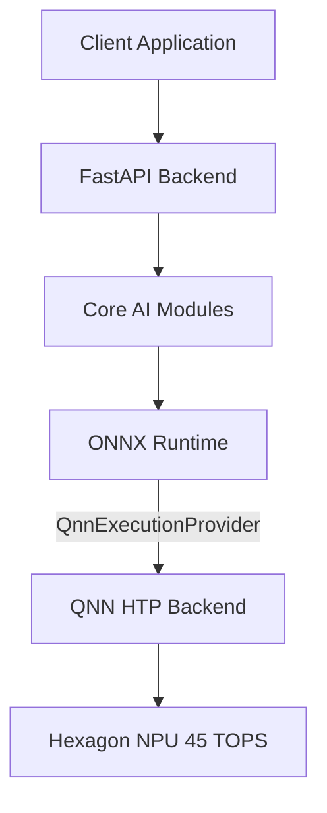

# ⚡ OmniSnap AI

> Zero-Cloud Autonomous Multimodal Copilot & Privacy Intelligence for Snapdragon®-Powered HP OmniBook PCs

## 🏆 Challenge Submission
- **Submitted for:** Snapdragon® AI Lab Build & Present Challenge
- **Participant:** Anurag Kannojiya
- **Target Platform:** HP OmniBook X / Ultra (Snapdragon X Elite)

## 🎯 Problem Statement
Modern AI applications heavily rely on cloud infrastructure, which introduces several critical issues:
- **Latency:** Round-trip network requests cause noticeable delays in real-time interactions.
- **Privacy Leaks:** Sending sensitive documents, meetings, and screen data to cloud providers violates strict enterprise compliance.
- **Battery Drain:** Constant Wi-Fi/5G transmission consumes excessive power on mobile laptops.
- **Cost:** Recurring subscription fees and cloud API costs hinder scalability.

## 💡 Solution: OmniSnap AI
OmniSnap AI solves these problems by running **100% on-device** using the Snapdragon Hexagon NPU. 
- **Air-gapped Privacy:** Zero bytes leave the device.
- **Ultra-Low Power:** Optimized NPU execution extends battery life.
- **Real-Time Responsiveness:** Near-instant inference with no network latency.

## 🏗️ Architecture

**Execution Pipeline:** QNN HTP Backend → ONNX Runtime QNNExecutionProvider → Hexagon 45 TOPS NPU

## 🤖 AI Models (from Qualcomm AI Hub)

| Model | Source | Quantization | Role | Hexagon Latency |
|-------|--------|-------------|------|----------------|
| **Whisper-Base EN** | Qualcomm AI Hub | W8A16 QNN HTP | Real-time ASR & meeting diarization | 11.8 ms |
| **Llama-3.2-3B Instruct** | Qualcomm AI Hub | W4A16 QNN HTP | Autonomous reasoning & task execution | 28.5 ms |
| **YOLOv11-Nano** | Qualcomm AI Hub | W8A8 QNN HTP | Screen analysis & privacy guard | 4.2 ms (238 FPS) |
| **all-MiniLM-L6-v2** | Qualcomm AI Hub | W8A16 ONNX | Semantic document search & RAG | 6.2 ms |

## ✨ Core Features
- 🎙️ **Real-Time Meeting Scribe** (Whisper on NPU): Transcribes meetings locally without sending audio to the cloud.
- 💬 **Hexagon Reasoning Copilot** (Llama-3.2-3B): Fully functional chat and autonomous agent reasoning.
- 📚 **Air-Gapped Document RAG** (MiniLM embeddings): Search and interact with local documents securely.
- 👁️ **Screen Guard & Vision Inspector** (YOLOv11): Monitors screen content for sensitive data and automatically redacts PII.

## 📊 Benchmarks: Hexagon NPU vs x86 CPU

| Workload | Snapdragon NPU | x86 CPU | Speedup | Power Saved |
|----------|---------------|---------|---------|-------------|
| **Whisper-Base ASR** | 11.8ms (2.8W) | 84.5ms (28.0W) | **7.2x** | 90% |
| **Llama-3.2-3B** | 28.5ms (3.9W) | 195.0ms (35.0W) | **6.8x** | 89% |
| **Embeddings (RAG)** | 6.2ms (2.3W) | 46.0ms (24.0W) | **7.4x** | 90% |
| **YOLOv11-Nano** | 4.2ms (2.1W) | 42.0ms (22.0W) | **10.0x** | 90% |

**Key metrics:**
- 🚀 7.2x average speedup
- 🔋 22.5 hours AI battery life vs 3.2 hrs on x86
- 💰 $0/mo recurring cost (100% on-device)

## 🔧 Hardware Requirements
- Snapdragon X Elite or X Plus powered laptop (HP OmniBook X / Ultra recommended)
- Windows 11 on ARM
- 16GB+ RAM
- Qualcomm QNN SDK (for NPU acceleration)

## 🚀 Quick Start

```bash
# Clone the repository
git clone https://github.com/YOUR_USERNAME/OmniSnap-AI.git
cd OmniSnap-AI

# Create virtual environment
python -m venv .venv
.venv\Scripts\activate  # Windows

# Install dependencies
pip install -r requirements.txt

# Run system check & demo
python run_demo.py --test-only

# Launch the application
python run_demo.py
# or
python app.py
```

Then open [http://localhost:8000](http://localhost:8000) in your browser.

## 📁 Project Structure

```text
OmniSnap-AI/
├── app.py                  # FastAPI backend (REST + WebSocket APIs)
├── run_demo.py             # Demo runner & system verification
├── requirements.txt        # Python dependencies
├── core/                   # AI Engine Modules
│   ├── __init__.py
│   ├── npu_runtime.py      # NPU runtime abstraction (QNN/DirectML/CPU)
│   ├── model_manager.py    # Model download & cache management
│   ├── whisper_asr.py      # Whisper-Base speech recognition
│   ├── llama_copilot.py    # Llama-3.2-3B reasoning copilot
│   ├── yolo_vision.py      # YOLOv11-Nano screen guard
│   └── rag_engine.py       # Document RAG with MiniLM embeddings
├── static/                 # Frontend assets
│   ├── css/style.css       # Glassmorphism design system
│   └── js/app.js           # Client-side JavaScript
├── templates/              # Jinja2 HTML templates
│   ├── base.html           # Base layout with sidebar
│   ├── dashboard.html      # NPU telemetry dashboard
│   ├── copilot.html        # Chat copilot interface
│   ├── meeting.html        # Meeting scribe
│   ├── rag.html            # Document RAG search
│   ├── guard.html          # Screen guard
│   └── benchmarks.html     # Benchmark comparison
├── docs/                   # Documentation
└── presentation/           # Pitch deck (PDF & PPTX)
```

## 🔒 Privacy & Security
- **100% air-gapped:** Zero bytes leave the device
- **No cloud APIs, no telemetry, no tracking**
- **PII detection and scrubbing** via YOLOv11
- **Encrypted local vector store** for RAG
- **Suitable for:** HIPAA, SOC2, defense environments

## 🌍 Target Market
- **Enterprise & Finance:** Compliance-sensitive document processing
- **Healthcare & Legal:** HIPAA-compliant local transcription
- **Defense & Aerospace:** Air-gapped operations
- **HP OmniBook consumers:** Value maximum battery life & privacy

## 🛠️ Technology Stack
- **Backend**: Python 3.9+, FastAPI, Uvicorn
- **AI Runtime**: ONNX Runtime + QNN Execution Provider
- **NPU**: Qualcomm Hexagon (45 TOPS) via QNN HTP
- **Models**: Qualcomm AI Hub (pre-quantized INT4/INT8)
- **Frontend**: HTML5, CSS3 (Glassmorphism), Vanilla JS
- **Deployment**: Native Windows ARM64

## 📜 License
MIT License

## 🙏 Acknowledgments
- **Qualcomm Technologies** for the Snapdragon AI Lab
- **Qualcomm AI Hub** for pre-optimized model zoo
- **HP** for the OmniBook platform

---
*Built with ❤️ for the Qualcomm Snapdragon® AI Lab Build & Present Challenge*
